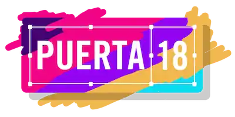
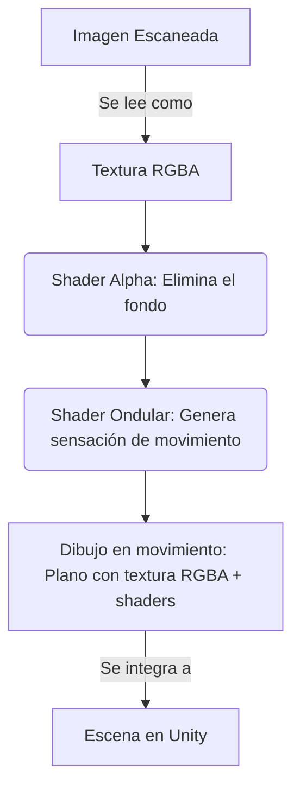
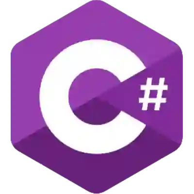
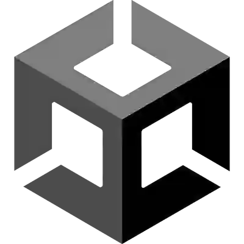

#  PMA/Shaders

   

Este repositorio es un fork del [Repositorio PMA de Puerta 18](https://github.com/FacuBritez/PMA) enfocado en el apartado de Shaders.

## 🎯 Objetivos
- Personajes:
  - Eliminar fondo de la textura 
  - Generar movimiento de los peces
- Fondo:
  - Generar movimiento de los elementos del fondo
  - Generar contraste dinámico para generar profundidad

## 🗺️ Flujo del Shader Principal

## 📂 Estructura
    /Assets
    ├── Prefabs/
    │   ├── Criatura/
    │   └── Fondo/
    └── Shaders/
        ├── PostProcesado/
        └── Superficie/  

## 💻 Stack
-   C#
-  HLSL

---

**Francisco y Ramón · Puerta 18 · 2026**

